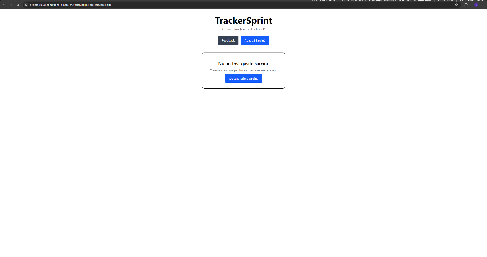
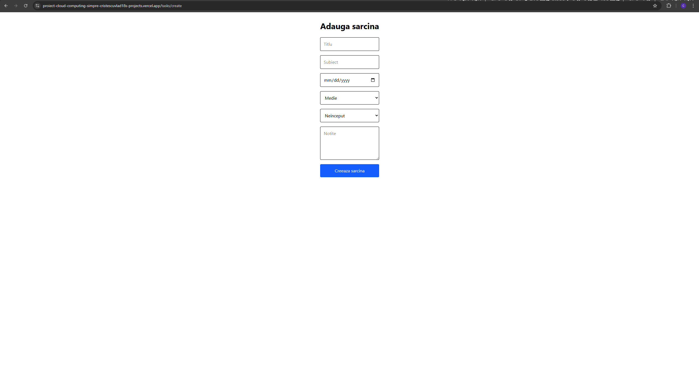
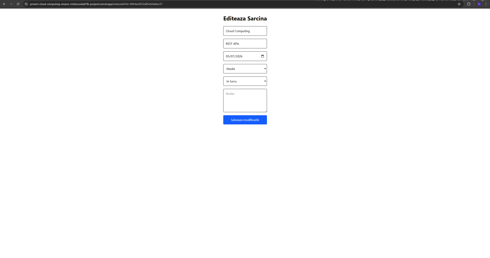
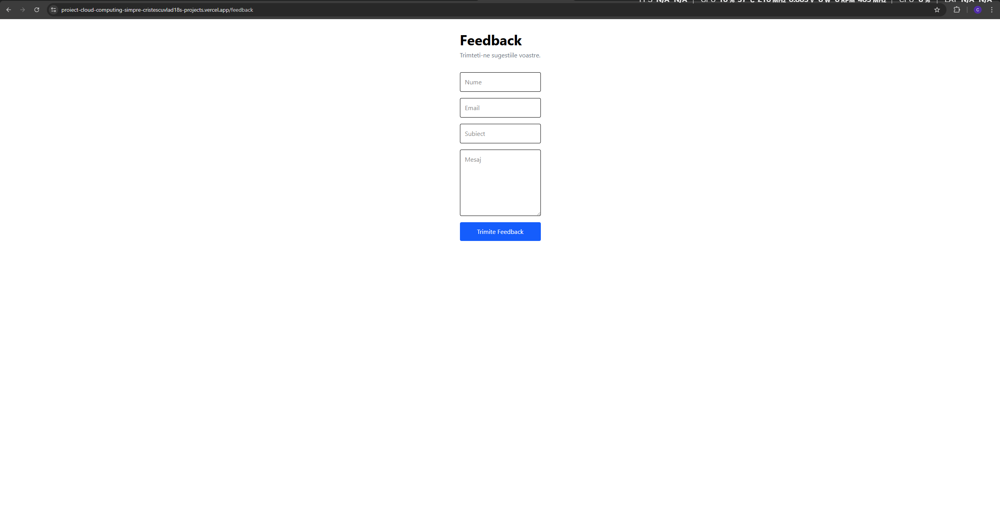

# TrackerSprint

**Masterand:** Cristescu Vlad-Mihai
**Grupa:** 1145

## Link prezentare video

https://www.youtube.com/watch?v=nW_XxNnG7ao

---

## Link aplicație publicată

https://proiect-cloud-computing-vladc.vercel.app/

---

# 1. Introducere

TrackerSprint este o aplicație web pentru organizarea sarcinilor. Aplicația permite utilizatorilor să creeze, vizualizeze, editeze și șteargă sarcini pentru o gestionare mai eficientă a acestora.

Proiectul a fost realizat folosind două servicii cloud:

* MongoDB Atlas pentru stocarea datelor
* SendGrid pentru trimiterea feedback-ului prin email

Aplicația este construită folosind Next.js și React, iar interfața este realizată cu Tailwind CSS.

---

# 2. Descriere problemă

Organizarea eficientă a activităților poate deveni dificilă atunci când există mai multe proiecte in paralel, persoane cu care este necesara colaborarea și deadline-uri.

TrackerSprint rezolvă această problemă prin oferirea unei aplicații simple și intuitive care permite:

* gestionarea task-urilor
* urmărirea statusului activităților
* setarea priorităților
* gestionarea deadline-urilor
* trimiterea de feedback pentru îmbunătățirea aplicației

Scopul principal al aplicației este creșterea productivității și eficienței în organizare.

---

# 3. Descriere API

Aplicația utilizează două API-uri REST principale:

## 3.1 Task Management API

Acest API gestionează operațiile CRUD pentru task-urile de studiu.

### Endpoint-uri utilizate

| Metodă HTTP | Endpoint       | Descriere                   |
| ----------- | -------------- | --------------------------- |
| GET         | /api/tasks     | Returnează toate task-urile |
| POST        | /api/tasks     | Creează un task nou         |
| GET         | /api/tasks/:id | Returnează un task după ID  |
| PUT         | /api/tasks/:id | Actualizează un task        |
| DELETE      | /api/tasks/:id | Șterge un task              |

### Exemplu request POST

```json
{
  "subject": "Cloud Computing",
  "topic": "REST APIs",
  "deadline": "2026-05-20",
  "priority": "Ridicata",
  "status": "In lucru",
  "notes": "Implementare CRUD"
}
```

### Exemplu response

```json
{
  "_id": "681a123456789",
  "subject": "Cloud Computing",
  "topic": "REST APIs",
  "deadline": "2026-05-20",
  "priority": "Ridicata",
  "status": "In lucru",
  "notes": "Implementare CRUD"
}
```

---

## 3.2 Feedback API

Acest API permite trimiterea feedback-ului prin SendGrid.

### Endpoint utilizat

| Metodă HTTP | Endpoint      | Descriere                   |
| ----------- | ------------- | --------------------------- |
| POST        | /api/feedback | Trimite feedback prin email |

### Exemplu request

```json
{
  "name": "Andrei",
  "email": "andrei@email.com",
  "subject": "Sugestie",
  "message": "Aplicația funcționează foarte bine"
}
```

### Exemplu response

```json
{
  "success": true
}
```

---

## Autentificare și autorizare servicii cloud

### MongoDB Atlas

Conectarea la baza de date se realizează prin connection string securizat utilizând variabile de mediu:

```env
MONGODB_URI=
MONGODB_DATABASE=
```

### SendGrid

Trimiterea email-urilor se realizează folosind un API Key:

```env
SENDGRID_API_KEY=
```

Toate datele sensibile sunt stocate în fișierul `.env.local` și nu sunt publicate în repository.

---

# 4. Flux de date

## Flux creare task

1. Utilizatorul completează formularul de creare task
2. Frontend-ul trimite un request POST către `/api/tasks`
3. API-ul validează datele
4. Datele sunt salvate în MongoDB Atlas
5. Serverul returnează task-ul creat
6. Frontend-ul actualizează interfața

---

## Flux editare task

1. Utilizatorul selectează un task existent
2. Frontend-ul trimite request GET către `/api/tasks/:id`
3. Datele sunt afișate în formular
4. Utilizatorul modifică informațiile
5. Frontend-ul trimite request PUT
6. MongoDB actualizează documentul
7. Interfața este actualizată

---

## Flux ștergere task

1. Utilizatorul apasă butonul „Șterge”
2. Frontend-ul trimite request DELETE
3. API-ul șterge documentul din MongoDB
4. Lista task-urilor este actualizată

---

## Flux feedback

1. Utilizatorul completează formularul Feedback
2. Frontend-ul trimite request POST către `/api/feedback`
3. API-ul utilizează serviciul SendGrid
4. Email-ul este trimis către adresa configurată
5. Utilizatorul primește mesaj de confirmare

---

# 5. Capturi ecran aplicație


## Homepage



---

## Pagina creare task



---

## Pagina editare task



---

## Pagina feedback



---

# Tehnologii utilizate

* Next.js
* React
* Tailwind CSS
* MongoDB Atlas
* SendGrid
* Vercel
* GitHub

---

# 6. Referințe

## Documentație oficială

* [https://nextjs.org/docs](https://nextjs.org/docs)
* [https://react.dev/](https://react.dev/)
* [https://tailwindcss.com/docs](https://tailwindcss.com/docs)
* [https://www.mongodb.com/docs/](https://www.mongodb.com/docs/)
* [https://www.twilio.com/docs/sendgrid](https://www.twilio.com/docs/sendgrid)
* [https://vercel.com/docs](https://vercel.com/docs)

---

# Repository GitHub

https://github.com/cristescuvlad18/proiectCloudComputingSIMPRE
